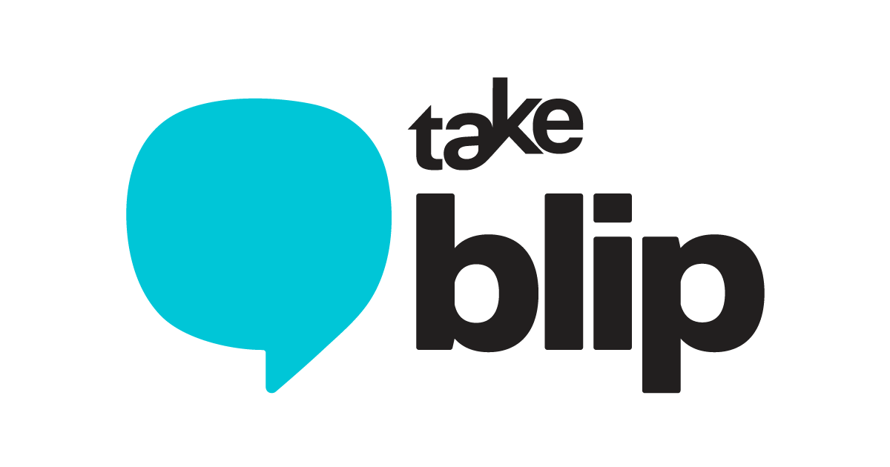
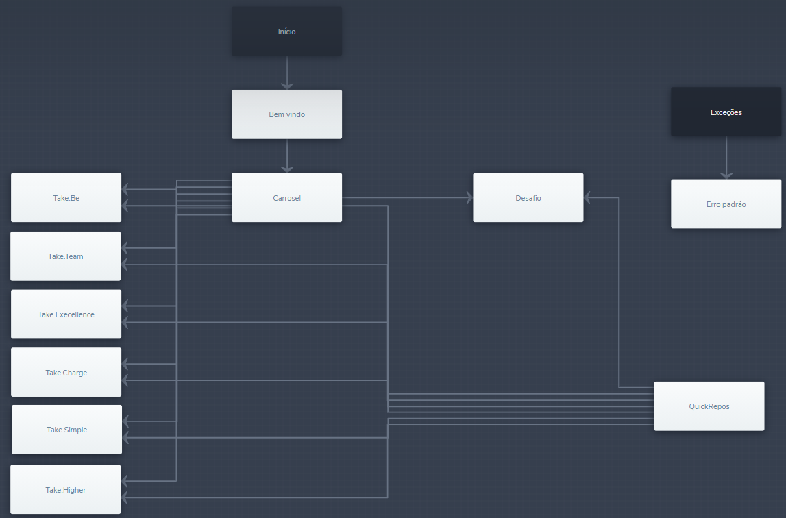
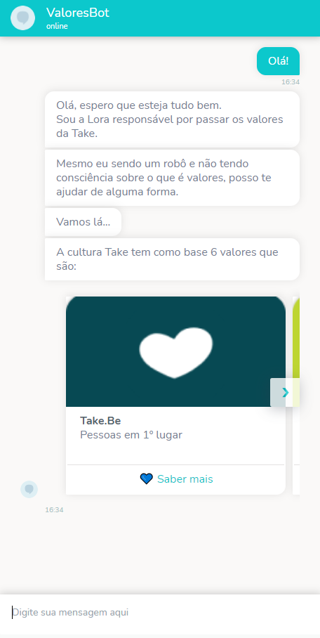
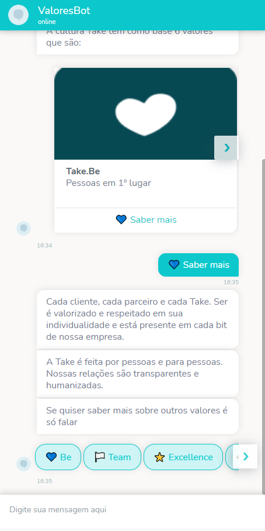
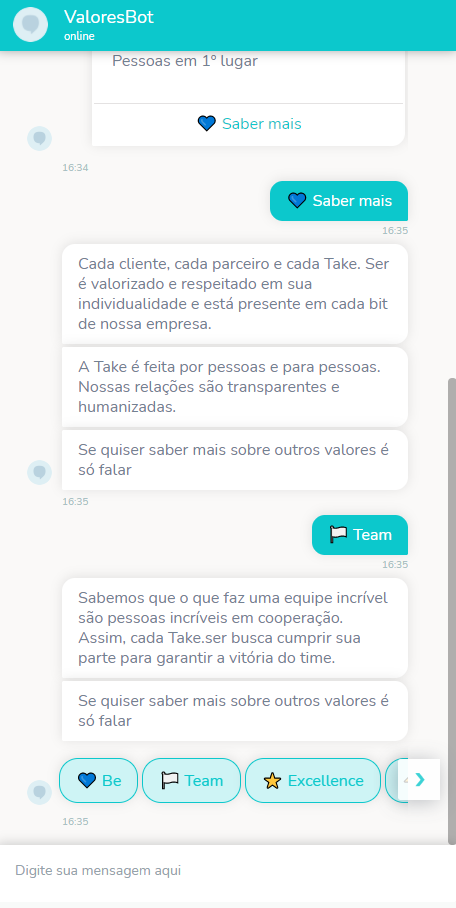
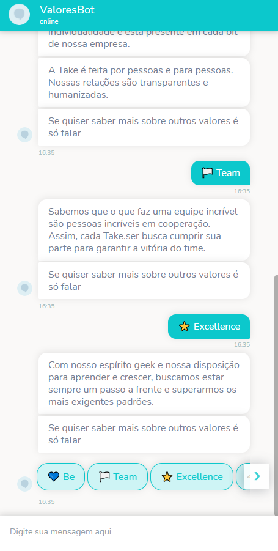
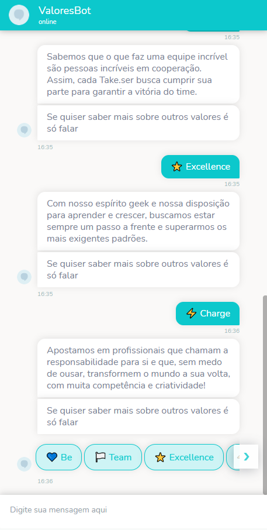
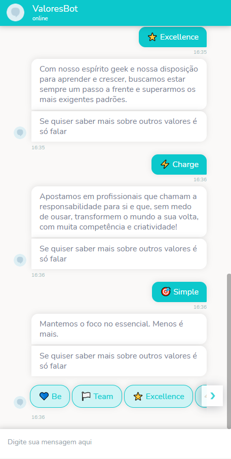
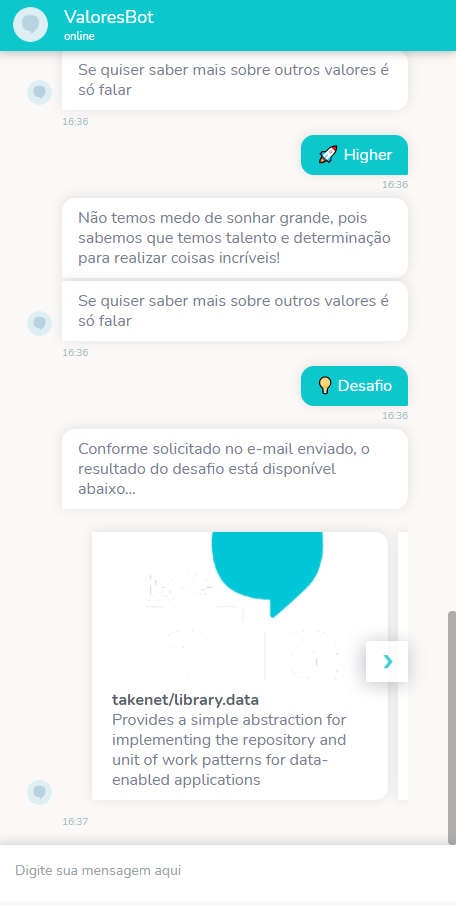
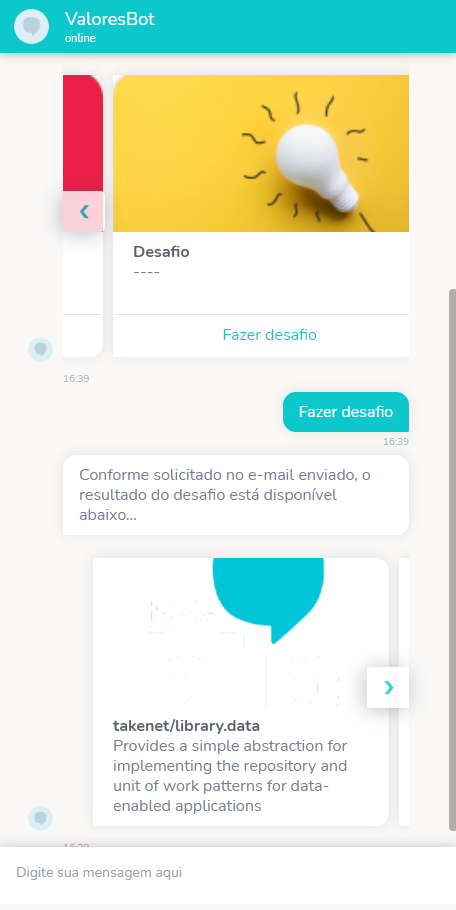

<!-- ******************************* Logotipo ****************************************  -->
<div align="center">
   
</div>
</br>
<!-- ******************************* Título do Projeto ****************************************  -->
<h1 align="center"> Desafio : Contato Inteligente (bot)</h1>

<!-- *******************************  Status do Projeto  **************************************  -->
<p align="center">
   Status do Projeto : Finalizado
</p>
<br/>

<!-- ************************************  Cronograma  ****************************************  -->

| Data       | Programação | Status |
| ---------- | ----------- | ------ |
| 15/07/2021 | Início      | ✔️      |
| 18/07/2021 | Entrega     | ✔️      |


<!-- ************************************  Badges  ********************************************  -->

<p align="center">
  

  <a href="https://rocketseat.com.br">
    
  </a>

  
  

</p>

<!-- ******************************* Ancoras **************************************************  -->

<h3 id="navegacao"> 🧭 Menu de Navegação </h3>

 - <a href="#sobre">Sobre o Projeto</a>
   - <a href="#resultados">Resultados Esperados</a>
   - <a href="#imagens">Imagens do Projeto </a>
 - <a href="#tecnologias">Tecnologias e Bibliotecas </a>
 - <a href="#configuracoes">Configurações</a>
 - <a href="#json">Formato do arquivo JSON</a>    
 - <a href="#rodando">Rodando o Projeto</a>
 - <a href="#links">Links Úteis</a>
 - <a href="#referencias">Referências</a>
 - <a href="https://github.com/brunoemferreira/DesafioTakeBotGitHub/blob/main/Flow/valoresbot.json">Fluxo do ChatBot</a>

<!-- ******************************* Sobre ***************************************************  -->

<h2 id="sobre"> 🚀 <a href="#navegacao"> Sobre o Projeto </a></h2>
O desafio consiste em criar um contato inteligente ( bot ) utilizando a plataforma Blip, o qual faça integração com uma API intermediária, que conversa com a API do GitHub e traz um JSON com informações dos repositórios que devem ser formatados conforme funcionalidades descritas na seção Funcionalidades.

<!-- ******************************* Resultados *****************************************  -->
<h3 id="resultados">✅ <a href="#navegacao"> Resultados Esperados </a> </h3>

- [X] O fluxo conversacional do seu chatbot deve estar exatamente como o que está sendo pedido noexemplo enviado;
- [X] Seu chatbot deve consumir a sua API intermediária (API que você criou para consumir a API do GitHub);
- [X] Você deverá exportar o fluxo do seu chatbot e inserir no repositório o .json do fluxo;
- [X] Ao final, nos envie o link do repositório para análise.

<!-- ******************************* Imagens do Projeto  *************************************  -->
<h3 id="imagens"> 🖼️ <a href="#navegacao"> Imagens do Projeto </a> </h3>

<div align="center">

<h4> <b>Fluxo</b> </h4>

</br>
    
<h4> <b>Telas do Bot</b></h4>










</div>

<!-- ************************* Tecnologias e Bibliotecas  ************************************  -->
<h3 id="tecnologias"> 🧰 <a href="#navegacao"> Tecnologias e Bibliotecas</a> </h3>

* [Portal Blip](https://account.blip.ai/login)
* [JavaScript](https://developer.mozilla.org/pt-BR/docs/Learn/JavaScript)
* [NodeJs](https://nodejs.org/en/)
* [Express](https://expressjs.com/pt-br/)
* [Nodemon](https://www.npmjs.com/package/nodemon)
* [Axios](https://www.npmjs.com/package/axios)
* [Cors](https://www.npmjs.com/package/cors)

<!-- *********************************** Configurações  **************************************  -->
<h3 id="configuracoes"> ☑️  <a href="#navegacao"> Configurações</a> </h3>

```javascript
// Deverá ser criado na raiz do projeto um arquivo .env com a seguinte diretiva
PORT=3000
```

<!-- *********************************** Configurações  **************************************  -->
<h3 id="json"> ☑️  <a href="#navegacao">Arquivo JSON</a> </h3>

> Formatação do arquivo JSON
```json
{
  "identificador do bloco":{
      "title" : "Título do Carrosel",
      "text" : "Subtitulo do Carrosel",
      "type" : "Tipo do arquivo de retorno da uri utilizar image/jpeg",
      "uri" : "uri da imagem do carrosel",
  }, ...
}
```
> Exemplo do Arquivo JSON
```json
{
  "0": {
    "title": "takenet/library.data",
    "text": "Provides a simple abstraction for implementing the repository and unit of work patterns for data-enabled applications",
    "type": "image/jpeg",
    "uri": "https://avatars.githubusercontent.com/u/4369522?v=4"
  }, ...
}
```

<!-- ******************************* Rodando o Projeto  **************************************  -->
<h3 id="rodando"> ⚙️ <a href="#navegacao"> Rodando o Projeto</a> </h3>

```bash
# Clone este repositório para a pasta anterior
$ git clone https://github.com/brunoemferreira/DesafioTakeBotGitHub.git
# ou use a opção de download.

# Acesse a pasta dtmoney
$ cd DesafioTakeBotGitHub

# Instale as dependências
$ yarn install
ou
$ npm install

# Executando o Projeto modo Desenvolvedor utilizando nodemon
$ yarn dev 
ou 
# Modo produção
$ yarn start 

# O projeto será iniciado na porta 3000 caso seja criado o arquivo .env senão ele iniciara na porta 8000
```

<!-- *********************************** Links Úteis  **************************************  -->
<h3 id="links"> 🔗 <a href="#navegacao">Links Úteis</a> </h3>

* [https://desafiotake-api.herokuapp.com/repos](https://desafiotake-api.herokuapp.com/repos) - Link da API em produção ( Heroku - Rodando em CI )

<!-- *********************************** Referências **************************************  -->
<h3 id="referencias"> ☑️  <a href="#navegacao"> Referências</a> </h3>

* [Documento do Desafio](https://github.com/brunoemferreira/DesafioTakeBotGitHub/blob/main/Assets/Documents/sobre-o-desafio.md)
* [Heroku](https://www.heroku.com/) - Serviço de Hospedagem da API
* [GitHub Docs - Repositories](https://docs.github.com/en/rest/reference/repos) - Referência para manipulação de URL da API de Repositórios
* [BlipDocs](https://docs.blip.ai/#carousel) - Manual de referência para montagem do JSON de integração
* [Blip Learning Center](http://learn.take.net/) - Curso Blip de Criação de ChatBots

---
